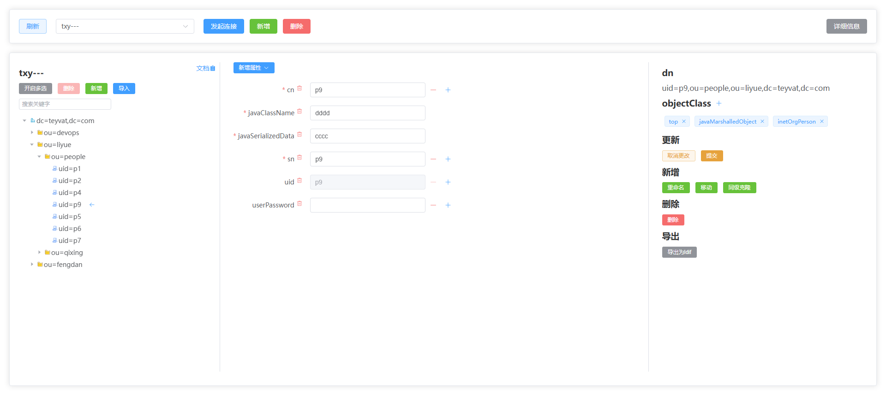

# OpenLdapUi
> [登录认证版](https://github.com/Teasnowy/OpenLdapUi-IAM)

项目地址
- [github](https://github.com/Teasnowy/OpenLdapUi)
- [gitee](https://gitee.com/qufudcj/OpenLdapUi)

openldap的可视化管理工具


# 构成
- api目录: python (建议版本3.8+)
- web目录: vue3 + vite

# 容器运行
> 容器内已集成上海时区和中文环境
```
docker pull qufudcj/openldapui:v2
docker run -dit --name openldapui -p 80:80 -p 997:997 qufudcj/openldapui:v2
```

# 自行编译
```
cd web
npm run build
mv dist ../web-dist
```

# 下载编译好的
web-dist目录就是编译好的前端静态文件, 可直接用于web服务器
- [百度云盘下载](https://pan.baidu.com/s/1r_rwmZw-n_RqO5aMfbl8Uw?pwd=9127)

# 运行环境
### 后端部分
```shell
# 安装依赖
pip install -r api/requeirments.txt

# 启动默认监听997端口, 如有需要可修改api/OpenLdapUi-api.py的app.run(host="0.0.0.0", port=997)
# 如需修改日志路径等启动配置, 可修改server-openldapui.sh的前几行变量, 都有注释
sh server-openldapui.sh start
# 停止
sh server-openldapui.sh stop
# 重启
sh server-openldapui.sh restart
# 或直接运行python脚本
python OpenLdapUi-IAM-api.py
```
### 前端部分
依赖web服务器, 以下举例nginx
```
server  {
    listen       80;
    index index.html index.htm index.php;
    # 你手动编译或下载编译好的web目录
    root  /xxxx/web-dist;

    location ~ .*\.(gif|jpg|jpeg|png|bmp|swf)$
    {
      expires      30d;
    }

    location / {
        try_files $uri $uri/ /index.html;
    }

    # /api是后端接口
    location /api {
        if ($request_method = 'OPTIONS') {
             return 200;
        }
        # 酌情修改997端口号
        proxy_pass   http://127.0.0.1:997;
        proxy_next_upstream off;
        proxy_set_header Upgrade $http_upgrade;
        proxy_set_header Connection "upgrade";
    }
}
```
